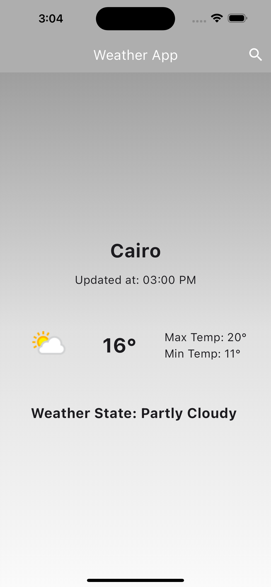

# Flutter Weather App

## Overview

This Flutter Weather App is a mobile application designed to provide users with real-time weather information for different locations. The app utilizes the OpenWeatherMap API to fetch weather data and demonstrates various Flutter development concepts, including UI design, state management using the Bloc pattern, and API integration.

## Features

- **Search Functionality:** Users can search for the current weather in various locations.
- **Dynamic Theme:** The app dynamically changes its theme color based on the current weather conditions.
- **Weather Icons:** Display weather icons corresponding to the current weather state.

## Screenshots

## Screenshots

  
  
  

# Technologies Used:
- Dart
- Flutter
- API (Dio) 
